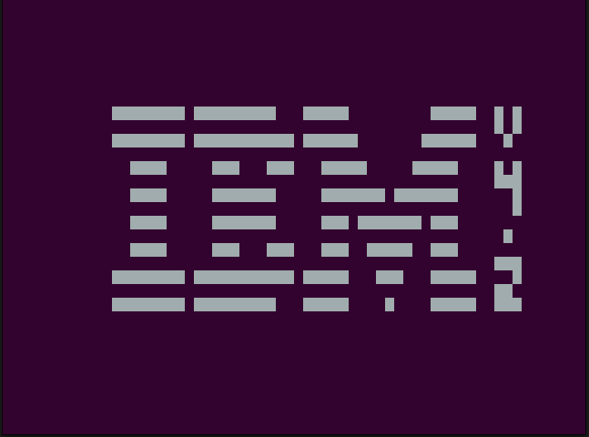

# Chip8

---

Chip-8 emulator written in C++ and tested with [Timendus test suite](https://github.com/Timendus/chip8-test-suite)


*IBM logo rendered by emulator*

## Build

To build the emulator, you need to run the following commands

``` bash
mkdir build
cmake . -Wno-dev -B build
```

If you want build tests include option -DCHIP8_TESTING=ON in the previous command

``` bash
cmake --build build
```

The emulator will be located on the path `build/src/chip8`

## Usage

To run the ROM, pass it as a command line parameter

``` bash
./chip8 my_rom.ch8
```

Some example games to run you can find in [directory](games/README.md)

## List of sources

- [Cowgod's Chip-8 Technical Reference v1.0](http://devernay.free.fr/hacks/chip8/C8TECH10.HTM#3.0)
- [Laurence Scotford's series of posts](https://www.laurencescotford.net/tag/chip-8/)
